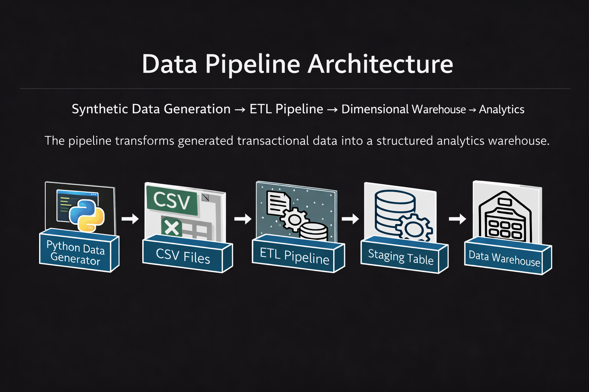
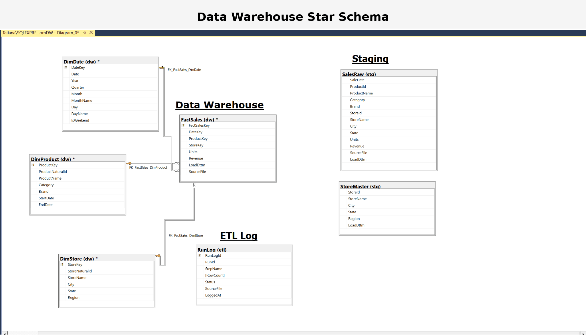
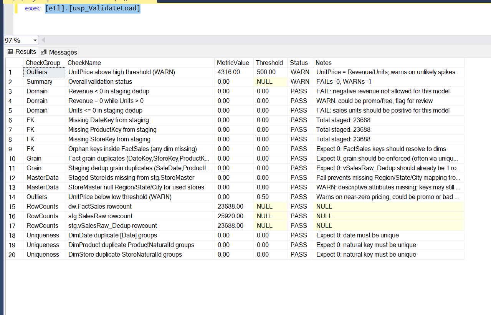

# E-Commerce Data Warehouse Pipeline (EcomDW)

## Overview

This project demonstrates an **end-to-end data engineering pipeline** built using **SQL Server** and **SSIS**.

The system:

* Generates **synthetic sales data** using **Python**
* Ingests the data through an **automated SSIS ETL pipeline**
* Loads the data into a **dimensional data warehouse (star schema)**
* Exposes the data for **analytics and reporting using SSRS**

The goal of this project is to simulate a **production-style data warehouse pipeline**, demonstrating data ingestion, transformation, dimensional modeling, and analytical reporting.

## 🛠 Tech Stack

## Data Engineering Practices

This project was designed to simulate production-style data engineering workflows.

Key practices demonstrated include:

- **Dimensional modeling** using a star schema (FactSales with supporting dimensions)
- **Automated ETL pipelines** using SSIS
- **Synthetic data generation** using Python to simulate real-world datasets
- **Incremental data loading** patterns to support repeatable ETL runs
- **Surrogate key resolution** between staging data and dimension tables
- **Data quality validation** to ensure referential integrity
- **Separation of staging and warehouse layers**

## Pipeline Walkthrough

The animation below demonstrates how data moves through the ETL pipeline from ingestion to analytics.

---

---

###  Data Validation Framework

A validation stored procedure acts as a data quality gate before pipeline completion.

## Validation checks include:

:hash: Row count comparisons across pipeline stages

:repeat_one: Duplicate fact grain detection

:mag_right: Missing dimension key checks

:lock: Domain rule validation

:moneybag: Price anomaly detection

:warning: If critical validation rules fail, the pipeline stops execution.

---

###  SSRS Sales Overview Report
The warehouse powers an SSRS report that provides an overview of sales performance.

---

  
Users can filter data by:

Category

Region

Brand

Store

Date range

---

# Future Enhancements:

Potential improvements include:

Incremental loading strategies

Slowly changing dimension support

Automated anomaly detection

Orchestration with modern tools such as Airflow

Author 

# Tatiana Valdes

