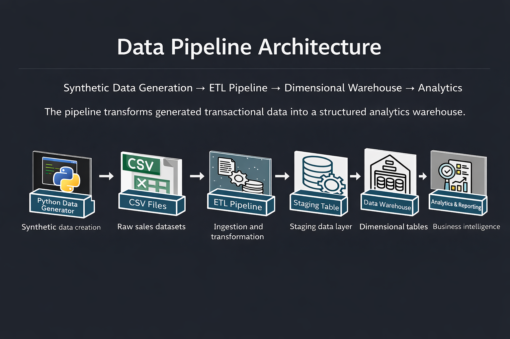
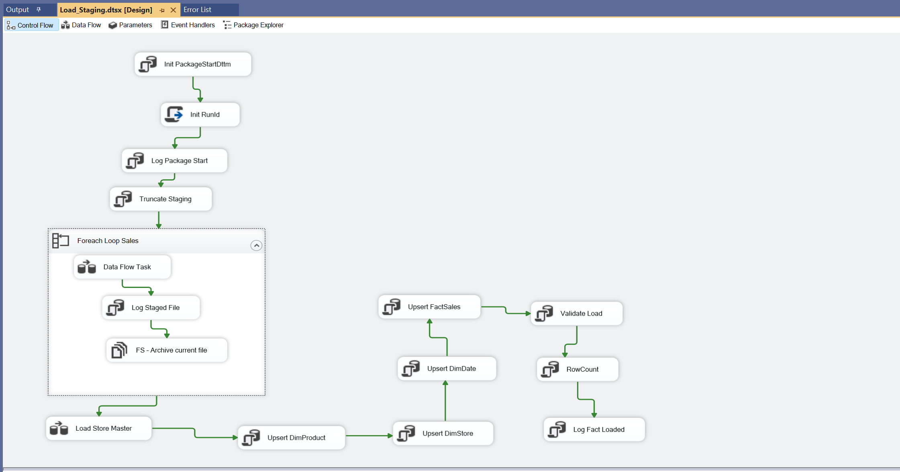
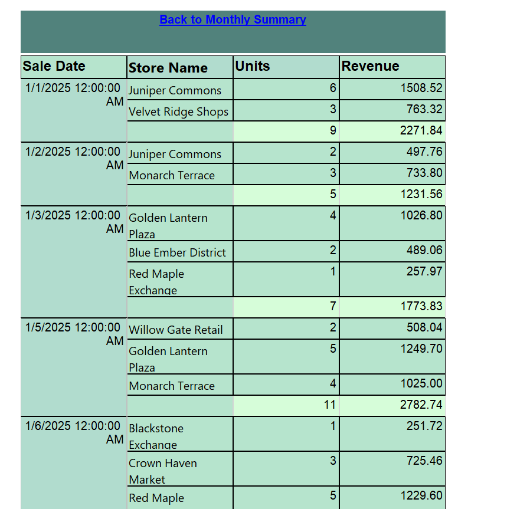

# E-Commerce Data Warehouse Pipeline (EcomDW)

Overview

An end-to-end data engineering project that simulates a production
data warehouse environment using SQL Server, SSIS, and SSRS.

# Key Engineering Concepts Demonstrated

✔ Dimensional Modeling:
Designed a star schema including DimDate, DimProduct, DimStore, and FactSales.

✔ Incremental Fact Loading:
Implemented UPDATE + INSERT logic to support idempotent pipeline execution.

✔ Surrogate Key Resolution:
Natural keys resolved through dimension lookups during fact loading.

✔ Data Quality Validation:
Custom validation stored procedure ensures pipeline integrity before loading.

✔ Lineage Tracking:
SourceFile and LoadDttm columns enable full auditability.

  
  ### Tools: SQL Server | SSIS | SSRS | Git | Data Warehousing

### 1️⃣ Warehouse Schema
The warehouse follows a star schema design optimized for analytical workloads.

### 2️⃣ SSIS Control Flow
The ETL pipeline is orchestrated using SQL Server Integration Services (SSIS).

# Key Pipline Stages Include:
Pipeline initialization

✔ Staging loads

✔ Dimension upserts

✔ Fact table loading

✔ Validation framework

✔ Execution logging

---

### 3️⃣ Data Flow
CSV files are processed through an SSIS data flow which performs transformations before loading staging tables.

# Transformations performed:

Data type conversions        •       Error handling paths     •          Staging table insertion

  
### 4️⃣ Staging Layer
Raw source data is first loaded into the staging table:

stg.SalesRaw

The staging layer serves several purposes:

Preserve raw source data

Enable validation and cleansing

Support reprocessing if needed
---

### 5️⃣ Deduplication Logic
To enforce the correct grain of the dataset, a staging view removes duplicate records.

Grain Enforced:

SalesDate
ProdectId
StoreId

Implementation uses a window function:

ROW_NUMBER() OVER (
PARTITION BY SaleDate, ProductId, StoreId
ORDER BY LoadDttm DESC
)

Only the most recent record per grain is retained.
---

### 6️⃣ Dimension Upserts
Dimension tables are maintained using an upsert pattern:

Update existing dimension records if attributes change

Insert new dimension records when the natural key does not exist

This ensures the warehouse dimensions stay synchronized with the incoming source data.

---

### 7️⃣ Fact Table Loading
Fact records are loaded after dimension tables are updated.

The fact table grain is defined as:
DateKey
ProductKey
StoreKey

Surrogate keys are resolved by joining staging data to dimension tables.

Duplicate facts are prevented using NOT EXISTS checks.

### 8️⃣ Pipeline Observability
Each pipeline execution generates a unique RunId.

This identifier allows all ETL steps to be associated with a single execution.

Execution metadata is stored in:

etl.RunLog

Example tracked information:

Pipeline step name

Row counts

Execution status

Timestamps

### 9️⃣ Data Validation Framework

A validation stored procedure acts as a data quality gate before pipeline completion.

## Validation checks include:

Row count comparisons across pipeline stages

Duplicate fact grain detection

Missing dimension key checks

Domain rule validation

Price anomaly detection

If critical validation rules fail, the pipeline stops execution.

---

### 🔟 SSRS Sales Overview Report
The warehouse powers an SSRS report that provides an overview of sales performance.

  
Users can filter data by:

Category

Region

Brand

Store

Date range

### 1️⃣1️⃣ Drill-Through Detail Report

# Technologies Used :

Python

SQL Server

SSIS

SSRS

# Key Concepts Demonstrated:

This project demonstrates several core data engineering practices:

Dimensional modeling

Surrogate key resolution

ETL pipeline orchestration

Data validation frameworks

Pipeline observability

BI reporting integration

---

# Future Enhancements:

Potential improvements include:

Incremental loading strategies

Slowly changing dimension support

Automated anomaly detection

Orchestration with modern tools such as Airflow

